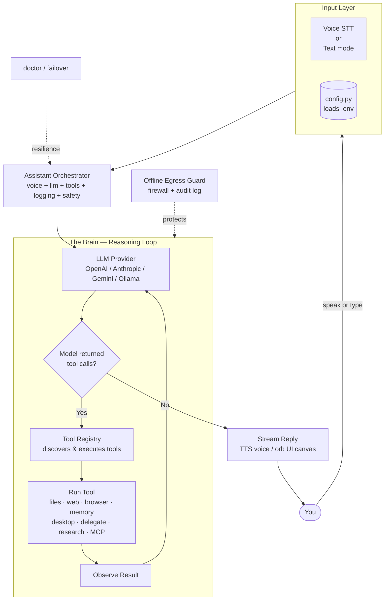

# JAMES — Just A Modular Executive System

JAMES is an open-source, voice-first assistant that runs on your own computer. It reads and writes files, creates documents, browses the web, controls applications, takes screenshots, and automates almost anything a person can do at a laptop — driven by an LLM agent that decides which tools to call and chains them together to finish real tasks.

JAMES is provider-agnostic and modular. You can use OpenAI, Anthropic, Google Gemini, OpenRouter, Groq, or any OpenAI-compatible local model (Ollama, LM Studio, vLLM). You change the model with a single setting, and you add new capabilities by dropping a tool into the registry.

## Why JAMES is useful

- Voice-first by default, with a quiet text mode when you prefer.
- Real agentic reasoning: the model calls tools and combines their results to complete tasks, not just talk about them.
- One interface for every provider. Swap models without touching agent code.
- Ships with a broad set of built-in tools.
- Easy to extend: add a capability in a few lines with the `@tool` decorator.
- Safety-aware: destructive actions can ask for confirmation and are logged.
- Optional fully-offline mode so nothing leaves your machine.
- Conversation history persists across sessions with LLM-powered summarization.
- Web dashboard for remote management and monitoring.
- Self-learning Skill Forge that turns completed workflows into native tools.
- Privacy-certified offline mode with verifiable egress firewall.

## What JAMES can do

| Area | Tools |
|------|-------|
| Files | `read_file`, `write_file`, `list_directory`, `search_files`, `delete_file` |
| Documents | `create_word_document`, `create_powerpoint`, `create_pdf` |
| Web | `web_search`, `fetch_url` |
| Browser | `browser_navigate`, `browser_click`, `browser_type`, `browser_extract`, `browser_screenshot`, `browser_close`, `browser_health` (auto-recovers from crashes) |
| Computer-use | `computer_use`, `click_at`, `type_text`, `press_key`, `screenshot_save` |
| Memory | `remember`, `recall` (long-term, cross-session semantic memory) |
| Scheduling | `schedule_task`, `list_scheduled`, `cancel_task` |
| System | `run_shell_command`, `open_application`, `take_screenshot`, `get_system_info`, `control_media`, `clipboard` |
| Multimodal | `upload_image` — upload images for vision-capable LLM analysis |
| Plugins | any tool you drop into `james/plugins/` or `./plugins/` |
| Delegation | `delegate` — fan out subtasks to isolated sub-agents in parallel |
| MCP | Connect any Model Context Protocol server; its tools appear automatically |
| Skill Forge | `save_skill`, `list_skills`, `forget_skill` — and automatic generation of native tools |
| Research | `research` — look a topic up on the web, read the top sources, and return a cited answer |
| Learning | `learn_skill` — research a goal, then write and save a new native `@tool` that implements it (JAMES teaches itself) |
| Background | `background_task`, `list_background_tasks`, `get_background_result` — run long or independent work asynchronously |
| File ops | `create_directory`, `copy_file`, `move_file`, `rename_file`, `directory_tree` — manage the whole file tree |
| File Manager | `manage_files`, `list_file_manager_tasks`, `stop_file_manager` — take 100% agentic control of the file explorer and organise it in the background |
| Help | `help` — list all available tools and capabilities |
| Task Graph | `task_dependency_graph` — visualize tool call chains as a DOT graph |
| Marketplace | `search_plugins`, `list_plugins`, `install_plugin`, `remove_plugin` — browse and manage community plugins |

## Quick start

One line on Linux, macOS, or WSL:

```bash
curl -fsSL https://raw.githubusercontent.com/Krish-1507/Voice-Automated-Desktop-Agent-J.A.M.E.S/main/install.sh | bash
```

One line on Windows (PowerShell):

```powershell
irm https://raw.githubusercontent.com/Krish-1507/Voice-Automated-Desktop-Agent-J.A.M.E.S/main/install.ps1 | iex
```

The one-line installer clones the repository if you are not already inside it, creates a virtual environment, and installs JAMES with the orb GUI and the MCP client by default. Add flags to install more: `--with-browser`, `--with-voice`, `--with-desktop`, `--with-docs`, `--with-all`, or `--minimal` for core only.

Manual setup:

```bash
git clone https://github.com/Krish-1507/Voice-Automated-Desktop-Agent-J.A.M.E.S.git
cd "Voice-Automated-Desktop-Agent-J.A.M.E.S"
python -m venv .venv && source .venv/bin/activate   # Windows: .venv\Scripts\activate
pip install -e ".[ui,mcp]"   # add extras you want: docs, browser, voice, desktop, all
cp .env.example .env          # edit: set LLM_PROVIDER + your API key, or custom for Ollama
python -m james --check
python -m james doctor        # optional self-diagnostics
python -m james --text        # or: python -m james --ui
python -m james --web-dashboard   # launch web dashboard on http://127.0.0.1:8123
```

Minimal `.env` for a cloud provider:

```dotenv
LLM_PROVIDER=openai
LLM_MODEL=gpt-4o-mini
OPENAI_API_KEY=sk-...
VOICE_ENABLED=false
```

Minimal `.env` for a fully local setup (no API keys at all):

```dotenv
LLM_PROVIDER=custom
LLM_MODEL=llama3.1
CUSTOM_BASE_URL=http://localhost:11434/v1   # Ollama
CUSTOM_API_KEY=ollama
VOICE_ENABLED=false
```

And for a privacy-certified, zero-egress run (everything on your machine):

```dotenv
OFFLINE_MODE=true
LLM_PROVIDER=custom
LLM_MODEL=llava                 # a local vision model for computer-use
VISION_MODEL=llava
CUSTOM_BASE_URL=http://localhost:11434/v1
CUSTOM_API_KEY=ollama
VOICE_ENABLED=false
pip install "james-assistant[desktop,memory]"
```

### Per-tool permissions

You can individually enable or disable tools via `.env`:

```dotenv
TOOL_run_shell_command=false
TOOL_delete_file=false
TOOL_web_search=true
```

Or set `ALLOWED_TOOLS` and `DENIED_TOOLS` as comma-separated lists:

```dotenv
ALLOWED_TOOLS=read_file,write_file,web_search
DENIED_TOOLS=run_shell_command,delete_file
```

## Providers and model selection

Pick a provider with `LLM_PROVIDER` and the exact model with `LLM_MODEL`. Because the model id is fully editable, you choose what fits best for cost, speed, and capability.

| `LLM_PROVIDER` | Env key | Example `LLM_MODEL` |
|----------------|---------|---------------------|
| `openai` | `OPENAI_API_KEY` | `gpt-4o`, `gpt-4o-mini`, `o3-mini` |
| `anthropic` | `ANTHROPIC_API_KEY` | `claude-4-5-sonnet-latest`, `claude-4-8-opus-latest` |
| `gemini` | `GEMINI_API_KEY` | `gemini-3-pro`, `gemini-3.5-flash` |
| `openrouter` | `OPENROUTER_API_KEY` | `anthropic/claude-4-5-sonnet`, `openai/gpt-4o` |
| `groq` | `GROQ_API_KEY` | `llama-3.3-70b-versatile` |
| `custom` | `CUSTOM_BASE_URL` + `CUSTOM_API_KEY` | any OpenAI-compatible model |

Voice providers are flexible:

- STT: `whisper_local` (offline), `whisper_api`, `google`, `none` (typed).
- TTS: `pyttsx3` (offline), `edge` (free, high quality), `openai`, `elevenlabs`, `none`. Each provider uses its own playback function with no cross-provider coupling.

## Extensibility: MCP, Skill Forge, and Marketplace

### MCP — inherit the whole ecosystem

Install the MCP extra, then point JAMES at any Model Context Protocol server (stdio or HTTP/SSE) through `MCP_SERVERS` or an `mcp.json` file. Its tools show up in the registry like native ones, with no glue code per integration. MCP calls are robust against event-loop conflicts — they handle both running and non-running async contexts gracefully.

```json
[{"name":"fs","command":"npx","args":["-y","@modelcontextprotocol/server-filesystem","./workspace"]}]
```

### Skill Forge — JAMES teaches itself

After a complex task, you can say "save this as a skill called <name>" and JAMES writes a real, typed `@tool` plugin to `./plugins/`, validates it, and loads it immediately. Unlike generic "skills" (free-text recipes), the result is a directly executable native tool — no re-implementation and no re-prompting next time. Manage them with `list_skills` / `forget_skill`.

Self-improving Skill Forge (automatic): with `AUTO_SKILL=true` (the default), after a successful multi-tool task JAMES generates that capability as a native `@tool` on its own. It inspects the tool chain it just ran, asks the model to write a clean `@tool` plugin that encapsulates the workflow, validates it, scans for dangerous imports (os, subprocess, sys, shutil), applies a restricted builtins sandbox before execution, persists it to `./plugins/`, and hot-loads it. Next time, the model can call the saved tool directly.

### Plugin Marketplace

JAMES includes a curated plugin marketplace for discovering and installing community tools:

```
search_plugins(query="file organizer")
install_plugin("file-organizer")
list_plugins()
remove_plugin("file-organizer")
```

Built-in marketplace entries: file-organizer, web-scraper, email-sender, calendar-sync, note-taker.

### Computer-use (vision desktop control)

`computer_use` runs a tight local loop: it screenshots the screen, asks a vision model what to do next, acts with `pyautogui` (click, type, scroll), and repeats until the instruction is done. No cloud browser is required; pair it with a local vision model such as Ollama's `llava` in offline mode. Granular control tools `click_at`, `type_text`, `press_key`, and `screenshot_save` are also available.

### Delegation

`delegate` spins up isolated sub-agents for parallel subtasks and combines their results, so you can split a big job across threads in a single request. Sub-agent tool calls stream into the same live task canvas as the parent.

### Research and self-learning

JAMES is built to be self-learning: it looks things up, teaches itself new skills, and grows more capable the more you use it.

- `research(query)` searches the web, reads the top sources, and returns a concise cited answer. Sources are reliably extracted from search results (including indented URL lines). Use it whenever the task needs current facts or how-to context.
- `learn_skill(goal)` researches the goal, asks the model to write a native `@tool` plugin that implements it, and saves it to `./plugins/` where it is hot-loaded and available immediately. This is the self-improving loop: research, understand, and turn it into executable code — no re-prompting next time.

The system prompt is explicit: whenever JAMES lacks a capability it must research it and learn it, then use the skill it just created. Combined with the auto Skill Forge (above), JAMES becomes more capable after every real task rather than forgetting what it did.

### Background execution

`background_task(task)` runs a request in an isolated sub-agent on a daemon thread and returns a task id right away, so JAMES can keep helping you while the work continues. Later, `get_background_result(id)` returns the outcome and `list_background_tasks()` shows everything in flight. Background tasks are persisted, so they survive restarts. When a background task completes or fails, a desktop notification is sent automatically.

### Full file-explorer control

Beyond read/write/search/delete, JAMES can `create_directory`, `copy_file`, `move_file`, `rename_file`, and render a `directory_tree`. It manages your files proactively as part of completing a task. Destructive file operations (delete, move, rename) ask for confirmation unless disabled.

### Autonomous File Explorer Manager

`manage_files(scope, goal)` lets JAMES take full, 100% agentic control of a part of the filesystem and run the job in the background. It explores the directory tree, organises files by type or date, removes or quarantines duplicates, tidies names, and reports back — without interrupting you. The scope can be `desktop`, `documents`, `downloads`, `workspace`, `home`, `whole`, or any absolute path. It is fully autonomous: no confirmation prompts, no stop-and-ask, it works until the location is tidy. Track it with `list_file_manager_tasks` / `stop_file_manager`.

Enable `AUTO_FILE_MANAGER=true` to start a daemon that keeps your main folders (Desktop, Documents, Downloads, ...) organised on a schedule, so the file explorer manages itself. Set `FILE_MANAGER_INTERVAL` (seconds) and `FILE_MANAGER_SCOPES` to tune it.

## Optional GUI

### Orb GUI (PyQt5)

Prefer a visual shell? Install the UI extra, then run `python -m james --ui` to launch the orb interface: a live status orb, a task canvas that lists every tool the agent calls in real time, streaming replies revealed word by word, a full log, a conversation history panel, MCP server management, model switching, pause/cancel controls, and a system tray icon to hide, show, and quit. The assistant runs in a worker thread, and dangerous-action confirmation is handled via a non-blocking signal to the main thread (no `input()` calls that would freeze the GUI).

### Web Dashboard

Launch a browser-based dashboard for remote access:

```bash
python -m james --web-dashboard
```

The dashboard runs on `http://127.0.0.1:8123` and provides:
- Status overview (mode, offline, dry-run, etc.)
- Full tools list with allow/deny toggles
- Conversation history viewer with export
- MCP server management
- Agent memory visualization
- Per-tool permission configuration

## Privacy-certified offline mode

Run JAMES as a fully local assistant with `OFFLINE_MODE=true` (or `python -m james --offline`). A socket-level firewall blocks every non-loopback network attempt — both DNS resolution and TCP connections — so the LLM SDKs, the browser, and any future plugin cannot send data elsewhere. Only `127.0.0.1` / `localhost` is permitted, which is exactly where a local model like Ollama listens. Every allowed and blocked connection is written to `EGRESS_AUDIT_LOG`, so you (or an auditor) can prove that nothing left the machine. Web tools refuse explicitly in this mode.

## Doctor and resilience

- `python -m james doctor` runs a one-shot self-diagnostic that reports PASS/WARN/FAIL for the Python version, core and optional dependencies, API keys, microphone, `.env`, writable workspace, browser, computer-use, semantic memory, and offline mode. It is useful for first-run checks and bug reports.
- Model failover: set `LLM_FAILOVER="anthropic:claude-3-5-sonnet-latest,groq:llama-3.3-70b-versatile"` and JAMES automatically retries the next provider if the primary errors (rate limits, outages) so a task never dies mid-flight. Permanent errors (bad API key, auth failures, HTTP 401–403) are not retried, since they will not succeed on another provider — JAMES fails fast instead of wasting requests, and logs which provider actually served each request.
- Error handling: the assistant catches exceptions at the turn level and returns a generic message to the user rather than leaking internal details (file paths, API keys, stack traces) that may be present in exception text.

## Conversation export

Export your conversation history for sharing or review:

```python
from james.core.assistant import Assistant
assistant = Assistant()
assistant.export_conversation("json")    # saves to workspace/conversation_export.json
assistant.export_conversation("markdown") # saves to workspace/conversation_export.md
```

## Architecture

```
james/
├── __main__.py        # CLI entry point (--text, --voice, --provider, --model, --check, --offline, --ui, --web-dashboard, --eval)
├── config.py          # loads .env/.env.gpg into typed settings (LLM / Voice / Assistant)
├── llm/
│   ├── base.py        # LLMProvider + normalized LLMResponse / ToolCall
│   ├── providers.py   # OpenAI-compatible, Anthropic, Gemini implementations (with vision support)
│   └── factory.py     # builds a provider from settings, including failover
├── tools/
│   ├── base.py        # Tool base class, @tool decorator, JSON-schema generation, input validation
│   ├── registry.py    # discovers and executes tools, flags dangerous ones, HMAC audit log, modern importlib plugin discovery
│   ├── file_tools.py  # read / write / search the filesystem
│   ├── document_tools.py  # Word / PowerPoint / PDF generation
│   ├── web_tools.py   # search + fetch (refuse in offline mode)
│   ├── browser_tools.py  # Playwright click-through automation + health check
│   ├── desktop_tools.py  # computer-use + direct pyautogui control
│   ├── memory_tools.py   # long-term semantic memory (RAG over a local store)
│   ├── system_tools.py   # shell, apps, screenshots, media, clipboard, image upload
│   ├── delegate_tool.py  # parallel sub-agent delegation
│   ├── mcp_tools.py      # Model Context Protocol client
│   ├── forge_tools.py    # Skill Forge self-improvement
│   ├── background_tools.py  # async task execution + notifications
│   └── marketplace.py    # curated plugin registry
├── voice/
│   ├── stt.py         # speech-to-text providers
│   └── tts.py         # text-to-speech providers
├── core/
│   ├── agent.py       # the reasoning loop (LLM <-> tools), with retry and non-blocking confirmation
│   ├── assistant.py   # orchestrator: voice + llm + tools + logging + safety + history persistence
│   ├── computeruse.py # screenshot -> describe -> act vision loop
│   ├── guard.py       # offline egress firewall + audit log
│   ├── doctor.py      # self-diagnostic checks
│   ├── personality.py # system prompt
│   └── scheduler.py   # scheduled / recurring tasks
├── ui/
│   ├── orb.py         # PyQt5 orb GUI with live task canvas, streaming, and controls
│   └── dashboard.py   # web-based dashboard (HTTP server, no dependencies)
├── evaluation/        # benchmarking and evaluation framework
├── marketplace/       # curated plugin registry
├── tests/             # pytest test suite
├── legacy/            # archived legacy files
└── docs/              # documentation
```

The agent loop is simple and robust: it sends the conversation and tool schemas to the model; if the model returns tool calls, JAMES executes them, feeds the results back, and repeats until the task is done or a step limit is reached.

## Inside the Brain of J.A.M.E.S.

How a single request moves through JAMES — from your voice or text, into the reasoning loop, out to tools, and back as an answer:



The loop runs until the task is complete or a step limit is reached; every tool call is logged to the audit trail and dangerous actions can require confirmation.

## Adding a tool

```python
from james.tools.base import tool

@tool(
    "translate_text",
    "Translate text into another language.",
    {
        "text": {"type": "string", "description": "Text to translate."},
        "target_lang": {"type": "string", "description": "Language code, e.g. 'fr'."},
    },
    required=["text", "target_lang"],
)
def translate_text(text: str, target_lang: str):
    # call your translation API
    return f"(translated) {text}"
```

Register it in `james/tools/registry.py` (add `translate_text` to `ALL_TOOLS`) and the model can use it immediately. You can also scaffold a plugin with `python -m james --new-tool my_tool` and drop it into `./plugins/`.

## Safety

- Tools that mutate the system (`run_shell_command`, `delete_file`, `open_application`, `computer_use`, `click_at`, `type_text`, `press_key`) are flagged dangerous and, when `CONFIRM_DANGEROUS_ACTIONS=true`, ask for confirmation before running.
- `run_shell_command` uses a command allowlist — only safe commands (echo, cat, grep, find, ls, python, curl, etc.) are permitted.
- `open_application` validates URL schemes and uses `shell=False` — only `http://` and `https://` are allowed, and no shell interpretation occurs.
- Scheduled tasks also sanitize command input — `subprocess.run(shell=False)` is used, preventing command injection even when commands originate from LLM output.
- JAMES never phones home. All calls go to the provider or endpoint you configure.
- Permission tiers: `JAMES_MODE=standard` blocks shell, delete, and app tools; `full` (default) enables them.
- Per-tool permissions: use `ALLOWED_TOOLS`/`DENIED_TOOLS` or `TOOL_<name>=true/false` in `.env` for fine-grained control.
- Dry-run: `DRY_RUN=true` simulates dangerous actions and logs them instead of executing.
- Audit log: every tool call is appended to `AUDIT_LOG` with HMAC-SHA256 signing for tamper evidence.
- `.env` world-readable warning: JAMES warns if your `.env` file is group/world-readable.
- Offline mode adds a verifiable egress firewall (see above).

## CLI Reference

```
python -m james [OPTIONS] [command]

Options:
  --text              Force text-only mode (no microphone).
  --voice             Force voice mode.
  --provider PROVIDER  Override LLM_PROVIDER (openai|anthropic|gemini|openrouter|groq|custom).
  --model MODEL       Override the model id.
  --check             Validate configuration and exit.
  --new-tool NAME     Scaffold a new plugin tool file in ./plugins/.
  --ui                Launch the PyQt5 orb GUI.
  --web-dashboard     Launch the web-based dashboard on http://127.0.0.1:8123.
  --offline           Privacy mode: block ALL non-local network egress (audited).
  --eval SUITE        Run a benchmark suite and print results.
  --doctor            Run self-diagnostic checks and exit.
  command             Optional command: 'doctor'.
```

## Roadmap

- [x] GUI / system-tray orb with live task canvas and streaming replies
- [x] Long-term semantic memory and RAG over your files
- [x] Multi-step scheduled tasks and reminders
- [x] Browser agent (Playwright) for full click-through automation
- [x] Computer-use vision loop (screenshot to act), local and cloud-free
- [x] Privacy-certified offline mode with egress audit log
- [x] Self-improving Skill Forge that auto-generates native `@tool` plugins
- [x] Autonomous File Explorer Manager: 100% agentic background file organisation (`manage_files`)
- [x] Conversation history persistence with LLM-powered summarization
- [x] Web dashboard for remote management and monitoring
- [x] Per-tool permission configuration via `.env`
- [x] Conversation export (JSON/Markdown)
- [x] Plugin marketplace for community tools
- [x] Multi-modal input (image upload for vision analysis)
- [x] Task dependency graph visualization
- [x] Agent memory visualization in UI
- [x] Tool output streaming in orb UI
- [ ] Mobile companion app

Contributions are very welcome — see `CONTRIBUTING.md`.

## License

MIT — do what you want, keeping the attribution.
